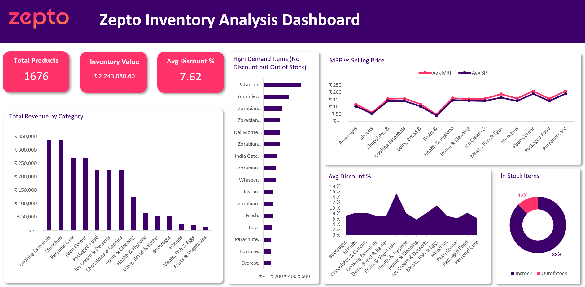

# E-Commerce Inventory Analysis
## Overview
Analyzed inventory data from Zepto using MySQL. Performed EDA, cleaned data, and answered key business questions and uncovered insights about inventory efficiency, pricing strategy, and potential sell-out risks.

The project workflow included:
- Data Cleaning with Python (Pandas)
- Database Storage and Exploration in MySQL
- Query-Based Business Analysis (19 SQL queries)
- Insight Visualization in Excel Dashboard

## Project Files
🐍 [Access the Python Notebook](zepto_inventory_analysis.ipynb)

🗃️ [View SQL Queries](zepto_inventory_analysis.sql)

📊 [Excel Dashboard](zepto_inventory_sales_dashboard.xlsx)

## Tools and Techniques Used
- __Data Cleaning – Python (Pandas):__
Removed invalid entries (e.g., products with mrp = 0 or discountedSellingPrice = 0), converted prices from paise to rupees, and reformatted columns for consistency.
- __Database Management – MySQL + SQLAlchemy:__
Loaded the cleaned dataset into a MySQL database using a SQLAlchemy engine for efficient querying and data integrity.
- __Exploratory Analysis – SQL:__
Wrote and executed 19 SQL queries to explore product pricing, discounts, stock availability, and revenue patterns across categories.
- __Visualization – Excel Dashboard:__
Designed an Excel dashboard to visualize key metrics such as high demand items, revenue by category, mrp vs selling price, etc.

## Key Insights
- Products with medium to high discounts (≥50%) show significantly higher out-of-stock rates (>85%), proving that aggressive discounting effectively drives sales but can lead to frequent stock shortages.
- Cooking Essentials and Munchies dominate in both estimated revenue and inventory weight, showing they are high-demand, high-volume segments that should remain inventory priorities.
- Premium essentials sell out even without discounts, showing steady demand.
- Fruits & Vegetables and Meats, Fish & Eggs receive the highest average discounts, reflecting the need for short-term promotions to clear time-sensitive inventory and maintain freshness.
- Some fast-moving discounted products face sell-out risks due to low stock.
- Discounts and stock availability show a clear negative correlation. As discounts increase, available stock levels drop — confirming that promotional pricing strongly influences buying behavior and product turnover speed.

## Dashboard Preview

## Conclusion
This project provided a complete Extract–Transform–Load (ETL) + SQL analysis + visualization pipeline for retail inventory management.

The findings highlight how discount strategies, product demand, and category performance interact to shape inventory outcomes.

By identifying high-performing categories, sell-out risks, and premium product trends, the analysis offers actionable insights for inventory planning and pricing optimization.

Overall, this project demonstrates the power of combining Python, SQL, and Excel to turn raw retail data into meaningful business intelligence.